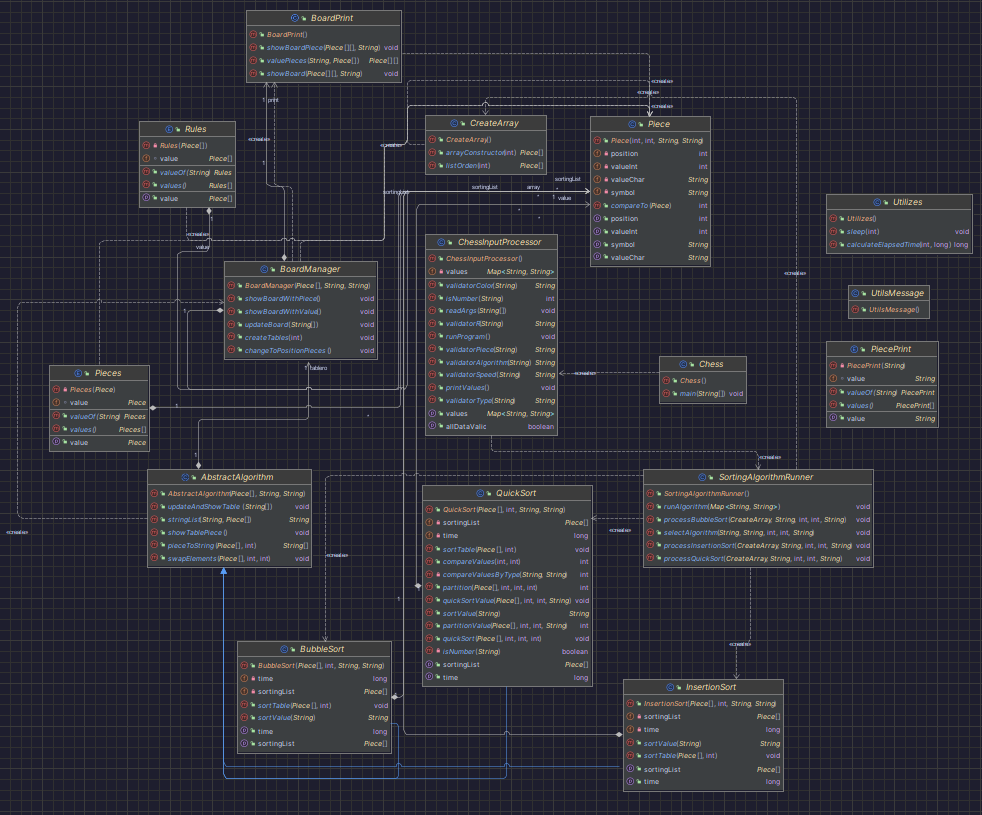

# Chess Sorting Algorithms - Visualización Interactiva

Proyecto en Java que muestra visualmente por consola el funcionamiento de algoritmos de ordenamiento mediante piezas de ajedrez en un tablero. El programa permite visualizar en tiempo real cómo **Bubble Sort**, **Insertion Sort** y **Quick Sort** organizan las piezas según su posición o valor.

## Descripción del Proyecto

Este proyecto combina conceptos de algoritmos de ordenamiento con una representación visual usando piezas de ajedrez. Las piezas se colocan en un tablero de 8x8 y se reorganizan en tiempo real, permitiendo observar paso a paso cómo funcionan los diferentes algoritmos de ordenamiento. Cada pieza tiene tres atributos:

- **Posición**: Ubicación inicial en el tablero (0-15)
- **Valor numérico**: Entero asignado a la pieza (1-16)
- **Valor alfabético**: Carácter asignado a la pieza (A-P)

El programa puede ordenar las piezas por cualquiera de estos valores y mostrar el proceso completo con animaciones controladas.

## ¿Cómo Iniciar?

### Compilación

```bash
cd Chess/src/main/java
javac jala/university/chess/*.java jala/university/chess/**/*.java
```

### Ejecución

```bash
java jala.university.chess.Chess a=ALGORITMO t=TIPO o=COLOR r=CANTIDAD in=r s=VELOCIDAD
```

### Parámetros de Entrada

| Parámetro | Descripción | Valores Válidos | Obligatorio |
|---|---|---|---|
| `a` | Algoritmo de ordenamiento | `b` (Bubble Sort), `i` (Insertion Sort), `q` (Quick Sort) | Si |
| `t` | Tipo de ordenamiento | `n` (Numérico/Entero), `c` (Carácter/Alfabético) | Si |
| `o` | Color de las piezas | `b` (Black/Negro), `w` (White/Blanco) | Si |
| `r` | Cantidad de piezas | 1, 2, 4, 6, 8, 10, 16 | Si |
| `in` | Confirmación | `r` (requerido) | Si |
| `s` | Velocidad de animación (ms) | 100 a 1000 | Si |

### Ejemplos de Uso

**Ejemplo 1:** Bubble Sort con 8 piezas negras, ordenamiento numérico, velocidad media
```bash
java jala.university.chess.Chess a=b t=n o=b r=8 in=r s=500
```

**Ejemplo 2:** Insertion Sort con 16 piezas blancas, ordenamiento alfabético, velocidad rápida
```bash
java jala.university.chess.Chess a=i t=c o=w r=16 in=r s=140
```

## Arquitectura del Proyecto

### Estructura de Paquetes

```
jala.university.chess/
├── Chess.java                    # Punto de entrada de la aplicación
├── ChessInputProcessor.java      # Procesamiento y validación de argumentos
├── SortingAlgorithmRunner.java   # Coordinador de ejecución de algoritmos
├── UtilsMessage.java             # Constantes de mensajes
├── algorithm/
│   ├── AbstractAlgorithm.java    # Clase base para algoritmos
│   ├── BubbleSort.java           # Implementación Bubble Sort
│   ├── InsertionSort.java        # Implementación Insertion Sort
│   └── QuickSort.java            # Implementación Quick Sort
├── array/
│   ├── CreateArray.java          # Generador de arrays de piezas
│   ├── Piece.java                # Modelo de pieza de ajedrez
│   ├── Pieces.java               # Enum de piezas disponibles
│   ├── PiecePrint.java           # Símbolos Unicode para piezas
│   └── Rules.java                # Reglas de cantidad de piezas
└── board/
    ├── BoardManager.java         # Gestión del tablero
    └── BoardPrint.java           # Visualización del tablero
```

## Clases Principales

### Capa de Entrada y Control

#### `Chess`
Punto de entrada de la aplicación. Inicializa el procesador de entrada y coordina el flujo del programa.

#### `ChessInputProcessor`
Responsable de:
- Parsear los argumentos de línea de comandos
- Validar cada parámetro según reglas específicas
- Convertir valores a formato interno
- Ejecutar el programa si todos los datos son válidos

#### `SortingAlgorithmRunner`
Coordinador que:
- Selecciona el algoritmo según el parámetro ingresado
- Crea el array de piezas inicial
- Ejecuta el algoritmo seleccionado
- Muestra resultados y tiempos de ejecución

### Capa de Algoritmos

#### `AbstractAlgorithm` (Clase Abstracta)
Proporciona funcionalidad común a todos los algoritmos:
- Gestión del tablero de visualización
- Conversión de piezas a strings
- Intercambio de elementos
- Actualización y visualización del tablero
- Control de velocidad de animación
- Cálculo de tiempo transcurrido

#### `BubbleSort`
Implementación del algoritmo Bubble Sort que:
- Compara elementos adyacentes repetidamente
- Intercambia elementos si están en orden incorrecto
- Muestra cada iteración en el tablero
- Soporta ordenamiento por posición, valor numérico o alfabético

#### `InsertionSort`
Implementación del algoritmo Insertion Sort que:
- Construye la lista ordenada elemento por elemento
- Inserta cada elemento en su posición correcta
- Visualiza el proceso de inserción en tiempo real

#### `QuickSort`
Implementación del algoritmo Quick Sort que:
- Utiliza estrategia divide y conquista
- Selecciona pivote y particiona el array
- Recursivamente ordena sub-arrays
- Muestra las particiones en el tablero

### Capa de Modelo

#### `Piece`
Representa una pieza de ajedrez con:
- `position`: Posición en el tablero (0-15)
- `valueInt`: Valor numérico (1-16)
- `valueChar`: Valor alfabético (A-P)
- `symbol`: Símbolo Unicode de la pieza

#### `Pieces` (Enum)
Define las 16 piezas de ajedrez:
- 1 Rey (King)
- 1 Reina (Queen)
- 2 Torres (Towers)
- 2 Alfiles (Bishops)
- 2 Caballos (Horses)
- 8 Peones (Pawns)

#### `Rules` (Enum)
Define las configuraciones válidas de cantidad de piezas:
- `RULE1`: 1 pieza (Rey)
- `RULE2`: 2 piezas (Rey + Reina)
- `RULE4`: 4 piezas (Rey + Reina + 2 Alfiles)
- `RULE6`: 6 piezas (Rey + Reina + 2 Alfiles + 2 Caballos)
- `RULE8`: 8 piezas (Rey + Reina + 2 Alfiles + 2 Caballos + 2 Torres)
- `RULE10`: 8 piezas (8 Peones)
- `RULE16`: 16 piezas (todas las piezas)

#### `CreateArray`
Utilidad para:
- Construir arrays de piezas según las reglas
- Mezclar aleatoriamente las piezas (shuffle)
- Retornar arrays desordenados listos para ordenar

### Capa de Visualización

#### `BoardManager`
Gestiona la lógica del tablero:
- Crea tablero 8x8
- Actualiza posiciones de piezas
- Coordina con `BoardPrint` para visualización
- Convierte entre representaciones de piezas

#### `BoardPrint`
Encargada de:
- Renderizar el tablero en consola
- Mostrar piezas con símbolos Unicode
- Mostrar valores (numéricos o alfabéticos)
- Aplicar colores a las piezas

## Diagrama de Clases



## Características Técnicas

- **Programación Orientada a Objetos**: Uso intensivo de herencia, polimorfismo y encapsulación
- **Patrón Template Method**: `AbstractAlgorithm` define la estructura común
- **Enumeraciones**: `Pieces`, `Rules` y `PiecePrint` para valores constantes
- **Generics**: Uso de `Comparable<Piece>` para comparaciones
- **Visualización en Consola**: Símbolos Unicode para representar piezas
- **Animación Controlada**: Velocidad ajustable para observar el proceso
- **Medición de Tiempo**: Calcula el tiempo de ejecución de cada algoritmo

## Requisitos del Sistema

- **Java Version**: 17.0.10 o superior

## Conceptos de Algoritmos

### Bubble Sort
**Complejidad temporal**: O(n²)  
**Complejidad espacial**: O(1)  
Algoritmo simple que compara pares de elementos adyacentes.

### Insertion Sort
**Complejidad temporal**: O(n²)  
**Complejidad espacial**: O(1)  
Construye la solución insertando elementos uno por uno.

### Quick Sort
**Complejidad temporal**: O(n log n) promedio, O(n²) peor caso  
**Complejidad espacial**: O(log n)  
Algoritmo eficiente que usa divide y conquista.

## Licencia

Proyecto educativo desarrollado con fines académicos.
